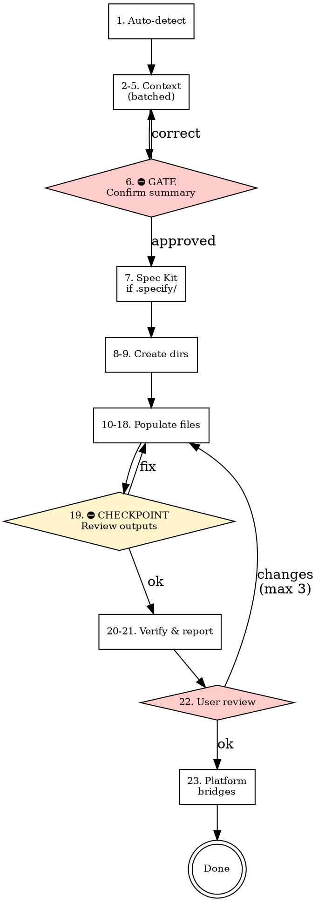

# My Harness

## Scaffold vs update

**Scaffold (default)** — User wants a new harness or first-time setup. Follow **Phases 1–5** below. Do not create files until Phase 1 step 6 (summary) is confirmed.

**Harness update** — Trigger when the user says e.g. `harness update`, `update harness`, `add domain to harness`, `add eval to harness`, `refresh docs`, `sync harness`, or when the repo already has `AGENTS.md` and `docs/` and the user clearly wants incremental changes. Follow **Harness update mode** (after Phases 1–5 section). If harness files are missing, tell them to run scaffold first.

### Hard gate (scaffold)

For **scaffold** only: Do NOT create any files or directories until Phase 1 is complete and the user has confirmed the summary table (step 6). This applies to every project regardless of perceived simplicity.

## Checklist (scaffold)

You MUST create a task for each item and complete them in order:

### Phase 1 — Gather context (batched where sensible)

1. **Auto-detect** — scan repo: target path, baseline (greenfield vs existing), stack, presence of `.specify/`
2. **Identity + detection table** — show detection results; ask project name & one-sentence purpose (free-form)
3. **Shape + architecture** — one interaction: project type + architecture style (structured choices)
4. **Domains** — key product areas for `docs/product-specs/*.md` (free-form)
5. **Add-ons + agent platforms** — one interaction: Superpowers / Evals / None (multi-select) **and** which agent tools the team uses (multi-select: Cursor, Claude Code, Codex, Windsurf, GitHub Copilot, Cline, Other)
6. **Confirm summary** — compact table, user approval ⛔ GATE: no files until approved

### Phase 1.5 — Spec Kit only

7. **Spec Kit check** — if `.specify/` exists: present coexistence plan, confirm (choice). If not detected, skip.

### Phase 2 — Create directory structure

8. **Create core directories** — `docs/`, subdirs per tree below
9. **Create add-on directories** — superpowers / evals dirs if enabled (no user checkpoint)

### Phase 3 — Populate files

10. **Populate root** — `AGENTS.md`, `ARCHITECTURE.md` (include **How to use this harness** per file-specs)
11. **Populate top-level docs** — DESIGN, PLANS, PRODUCT_SENSE, QUALITY_SCORE, RELIABILITY, SECURITY, FRONTEND (if applicable)
12. **Populate design docs** — `design-docs/index.md`, `core-beliefs.md`
13. **Populate exec plans** — tech-debt-tracker, `active/`, `completed/`
14. **Populate generated** — schema placeholder
15. **Populate product specs** — index + per-domain files
16. **Populate references** — LLM context stubs
17. **Populate Superpowers** — if enabled (workflow, specs/, plans/)
18. **Populate Evals** — if enabled (index, graders, example task)
19. **⛔ CHECKPOINT** — list all files created/updated in Phase 3; user may request fixes before Phase 4 (single checkpoint for core + add-ons)

### Phase 4 — Verify & review

20. **Verify cross-links** — paths and Markdown links resolve
21. **Final report** — summary table, next steps, native AGENTS.md support for Claude Code / Codex if selected
22. **User review** — changes if needed (max 3 rounds)

### Phase 5 — Post-generation (no extra questions)

23. **Agent platform bridges** — generate files per [references/file-specs.md](references/file-specs.md) “Agent platform bridge files” for each platform selected in step 5

## Process flow (scaffold)

## When to load references

- **Principles and constraints:** Read [references/harness-principles.md](references/harness-principles.md) before generating content.
- **Per-file content:** Follow [references/file-specs.md](references/file-specs.md) while filling each path.
- **Superpowers only:** If the user enables Superpowers, read [references/superpowers-addon.md](references/superpowers-addon.md) and add that tree.
- **Evals only:** If the user enables Evals, read [references/evals-addon.md](references/evals-addon.md) and add that tree.

## Phase 1 — Gather context

**Interaction rules:**

- **Batch related choices** — combine shape + architecture; combine add-ons + agent platforms in one step. Keep **identity** and **domains** as separate steps (free-form).
- Do **not** over-split: if two questions are both structured choices and closely related, present them together.
- Use structured multiple-choice where possible; include **Other (I'll describe)** where appropriate.
- Scan the repo **before** asking: infer stack, path, baseline, Spec Kit — show a **detection table** in step 2 alongside identity.

**Step 1 (auto)** — Scan for: repo root signals (`.git/`, `package.json`, etc.), existing `AGENTS.md` / `docs/`, stack files (`package.json`, `go.mod`, `pyproject.toml`, …), `.specify/`.

**Step 2** — Present: target path, baseline summary, stack summary, Spec Kit yes/no. Ask: project name + one-sentence purpose.

**Step 3** — Shape + architecture in one message:

- Shape: Frontend / Backend / Fullstack / CLI / Library / Monorepo / Other
- Architecture: Layered / Hexagonal / Microservices / Monolith / Other

**Step 4** — Domains (free-form): list key product areas; each becomes `docs/product-specs/<domain>.md`.

**Step 5** — Add-ons + agent platforms:

- Add-ons: Superpowers, Evals, None (multi-select; None excludes both)
- Agent platforms (multi-select): **Cursor**, **Claude Code**, **Codex**, **Windsurf**, **GitHub Copilot**, **Cline**, **Other**

CLI shortcuts: `--superpowers` / `--evals` in the user message set those add-ons to yes.

**Step 6 — Summary table + GATE**

| Topic | Capture |
| ----- | ------- |
| Identity | Name, one-sentence purpose |
| Target path | Repo root |
| Baseline | Greenfield vs existing |
| Stack | Languages, frameworks, tooling |
| Shape | Frontend / backend / … |
| Domains | List |
| Architecture | Style |
| Superpowers | Yes / no |
| Evals | Yes / no |
| Agent platforms | Which tools (for Phase 5 bridges) |

User approves → Phase 1.5. Superpowers/Evals layouts are listed in the summary; **no separate confirmation** in Phase 1.5 (fixes happen at checkpoint 19 or review).

## Phase 1.5 — Spec Kit only

Runs after step 6 if `.specify/` exists at repo root.

Present coexistence plan (append to `AGENTS.md`, `docs/PLANS.md` note, domain vs feature specs, evals vs `specs/` if Evals enabled). Options: proceed / adjust rules / skip Spec Kit integration.

**Coexistence rules (once confirmed):**

- Never overwrite `.specify/`, `specs/`, or agent command dirs.
- Existing `AGENTS.md` → append `## Documentation harness` with `docs/` links.
- `docs/product-specs/` = domain-level; Spec Kit `specs/` = feature-level.

If Spec Kit is absent, skip.

## Phase 2 — Create directory structure

After Phase 1.5, create missing dirs only (do not delete user files). Tree as before: `docs/design-docs/`, `exec-plans/active|completed/`, `generated/`, `product-specs/`, `references/`, plus `docs/evals/...` if Evals, `docs/superpowers/...` if Superpowers.

**No directory-tree checkpoint** — proceed to Phase 3.

## Phase 3 — Populate files

After directories exist, populate in order per [references/file-specs.md](references/file-specs.md). `AGENTS.md` **must** include **How to use this harness** (usage table) per file-specs.

**Single checkpoint (step 19):** After all files for steps 10–18 exist, list paths and ask for adjustments; then Phase 4.

## Phase 4 — Verify & review

1. List created/updated paths.
2. Confirm cross-links; include evals links if Evals enabled.
3. CI/lint reminder; Evals runner reminder if applicable.
4. User approval or fixes (max 3 rounds).

## Phase 5 — Agent platform bridges

For each platform selected in step 5, apply [references/file-specs.md](references/file-specs.md) **Agent platform bridge files**:

- **Cursor** — `.cursor/rules/harness.mdc` (or merge into existing rules)
- **Claude Code / Codex** — no extra file; note in final report that `AGENTS.md` is the primary entry
- **Windsurf** — append harness section to `.windsurfrules` (create if missing)
- **GitHub Copilot** — append to `.github/copilot-instructions.md` (create dirs if needed)
- **Cline** — append to `.clinerules` (create if missing)
- **Other** — short instructions in final report only

**Merge rule:** If a target file exists, **append** the harness bridge block; do not wipe unrelated content. Use a clear `<!-- harness-bridge:start -->` … `<!-- harness-bridge:end -->` marker where the format allows.

## Harness update mode

Use when the user requests update **or** when intent is incremental change on an existing harness (`AGENTS.md` + `docs/` present).

**If harness missing:** Say to run scaffold first.

**Flow (2–3 interactions):**

1. **Auto-detect** — Scan harness: domains, add-ons present, platforms, Spec Kit, key paths.
2. **Operation menu** — User selects one or more:
   - **Add domain** — new `docs/product-specs/<domain>.md`, update `product-specs/index.md`, update `AGENTS.md` nav if needed
   - **Remove domain** — confirm, remove file, update index and links
   - **Enable add-on** — add Superpowers or Evals tree per references (read addon doc)
   - **Disable add-on** — confirm; remove or soften links in `AGENTS.md` / `PLANS.md`; prefer marking dirs deprecated in docs rather than deleting without consent
   - **Add agent platform** — generate missing bridge file for newly chosen platform
   - **Complete exec plan** — move file `active/` → `completed/` (user names file)
   - **Add design doc** — new `docs/design-docs/<name>.md`, update index
   - **Refresh quality score** — suggest updates to `QUALITY_SCORE.md` from repo signals (tests, lint); user confirms
   - **Sync references** — suggest `docs/references/` updates
   - **Verify links** — Markdown link pass over harness docs
3. **Execute + report** — Apply changes; summarize diff; user confirms.

**Update rules:** Prefer **append** and **surgical edits** per file-specs **Harness update rules**; never bulk-replace user customizations.

## Anti-patterns

The following are **forbidden**:

- **Skipping ahead (scaffold)** — No file creation before step 6 summary approval.
- **Over-splitting** — Do not ask every Phase 1 question in isolation when batching is natural (shape+arch; add-ons+platforms).
- **Skipping auto-detection** — Scan the repo before asking what files already answer.
- **Silent assumptions** — If unsure, ask; do not invent defaults without user alignment on identity/domains.
- **Dropping tasks** — Every checklist item must be tracked and completed.
- **Skipping checkpoint 19** — User must have a chance to review populated outputs before Phase 4 verification (unless user explicitly says skip).
- **Wiping bridge or config files** — Always merge/append platform bridge content; never delete unrelated agent config.

## Notes

- Do **not** add README inside the **skill** folder beyond SKILL.md, references, and evals.
- Merge carefully into existing repos: preserve user content; add missing harness pieces.
- Spec Kit: detect, do not overwrite; append to `AGENTS.md`; document `specs/` vs `docs/product-specs/`.
