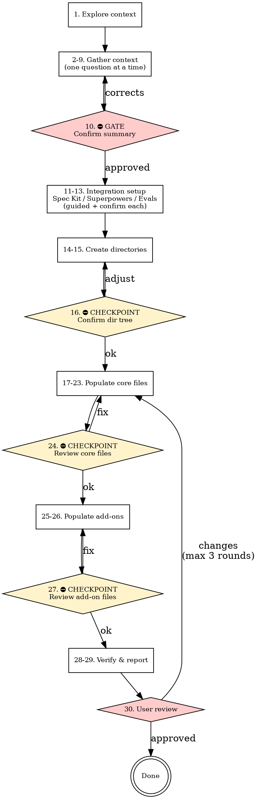

# My Harness

<HARD-GATE>
Do NOT create any files or directories until Phase 1 is complete and the user has confirmed the summary table. This applies to EVERY project regardless of perceived simplicity.
</HARD-GATE>

## Checklist

You MUST create a task for each of these items and complete them in order:

**Phase 1 — Gather context (one question at a time)**
1. **Explore project context** — scan repo for existing files, config, structure
2. **Ask identity** — project name & one-sentence purpose (free-form)
3. **Detect & confirm target path** — auto-detect repo root, confirm with user
4. **Detect & confirm baseline** — greenfield vs existing (choice)
5. **Detect & confirm stack** — scan config files, propose stack, confirm (choice)
6. **Ask shape** — project type: frontend / backend / fullstack / CLI / library / monorepo (choice)
7. **Ask domains** — key product areas, each becomes a product-spec (free-form)
8. **Ask architecture** — layered / hexagonal / microservices / monolith / other (choice)
9. **Ask add-ons** — Superpowers / Evals / None (multi-select)
10. **Confirm summary** — present table, get user approval ⛔ GATE: no files until approved

**Phase 1.5 — Integration detection & guided setup**
11. **Spec Kit check** — detect `.specify/`, if found present coexistence plan and confirm with user (choice)
12. **Superpowers guided setup** — if enabled: read addon ref, present workflow plan, confirm with user (choice)
13. **Evals guided setup** — if enabled: read addon ref, present eval plan, confirm with user (choice)

**Phase 2 — Create directory structure**
14. **Create core directories** — docs/, design-docs/, exec-plans/, etc.
15. **Create add-on directories** — superpowers / evals dirs if enabled
16. **⛔ CHECKPOINT: confirm directory tree** — show tree to user, ask "Does this structure look right?"

**Phase 3 — Populate files (group-by-group with confirmation)**
17. **Populate root files** — AGENTS.md, ARCHITECTURE.md → show to user for quick review
18. **Populate top-level docs** — DESIGN, PLANS, PRODUCT_SENSE, QUALITY_SCORE, RELIABILITY, SECURITY, FRONTEND (if applicable)
19. **Populate design docs** — index.md, core-beliefs.md
20. **Populate exec plans** — tech-debt-tracker, active/, completed/
21. **Populate generated** — schema placeholder
22. **Populate product specs** — index + per-domain files
23. **Populate references** — LLM context stubs
24. **⛔ CHECKPOINT: core files review** — list all core files created, ask user to confirm before add-ons
25. **Populate Superpowers** — workflow.md, specs/, plans/ (if enabled, otherwise skip)
26. **Populate Evals** — index, graders, example task (if enabled, otherwise skip)
27. **⛔ CHECKPOINT: add-on files review** — if add-ons enabled, show what was added, confirm (skip if no add-ons)

**Phase 4 — Verify & Review**
28. **Verify cross-links** — list all paths, check all Markdown links resolve
29. **Present final report** — summary table + next steps
30. **User review** — if changes requested, fix and re-verify (max 3 rounds)

## Process flow



## When to load references

- **Principles and constraints:** Read [references/harness-principles.md](references/harness-principles.md) before generating content.
- **Per-file content:** Follow [references/file-specs.md](references/file-specs.md) while filling each path.
- **Superpowers only:** If the user enables Superpowers, read [references/superpowers-addon.md](references/superpowers-addon.md) and add that tree.
- **Evals only:** If the user enables Evals, read [references/evals-addon.md](references/evals-addon.md) and add that tree.

## Phase 1 — Gather context (step-by-step)

Guide the user through the following questions **one at a time**. Present each question as a **structured choice** (multiple-choice where possible, with an "Other" option for free-form input). If the user has already provided some answers in the initial request, skip those and acknowledge them. Use information already available in the repo to **infer and pre-select** the most likely option.

**Interaction rules:**
- Use structured multiple-choice questions (e.g. AskQuestion tool) whenever possible.
- Always include an **"Other (I'll describe)"** option for free-form input.
- When auto-detection finds a strong signal (e.g. `package.json` with Next.js), pre-select that option and let the user confirm or change.
- For questions that are naturally open-ended (Identity, Domains), use free-form input directly.

**Step 1 → Identity** (free-form)
Ask: "What is the project name and a one-sentence purpose?"

**Step 2 → Target path** (auto-detect + confirm)
Auto-detect: check if cwd looks like a repo root (has `.git/`, `package.json`, etc.).
Options:
- `<detected path>` (recommended)
- Other path (I'll type it)

**Step 3 → Baseline** (choice)
Auto-detect: if `AGENTS.md`, `docs/`, or `.specify/` already exist, note what was found.
Options:
- Greenfield (empty project, create everything from scratch)
- Existing repo (merge with what's already here: `<detected files>`)

**Step 4 → Stack** (auto-detect + confirm)
Auto-detect: scan for `package.json`, `go.mod`, `pyproject.toml`, `Cargo.toml`, `pom.xml`, etc.
If detected, propose: "I found `<files>`, which suggests: `<stack summary>`. Is this correct?"
Options:
- Yes, that's correct
- Partially correct (I'll adjust)
- No, let me describe the stack

**Step 5 → Shape** (choice)
Infer from stack and directory structure if possible. Pre-select the inferred option.
Options:
- Frontend
- Backend
- Fullstack
- CLI
- Library
- Monorepo
- Other (I'll describe)

**Step 6 → Domains** (free-form)
Ask: "What are the key product domains? (e.g. auth, billing, admin — each becomes a `docs/product-specs/<domain>.md`)"
Suggest examples based on detected code structure if possible.

**Step 7 → Architecture** (choice)
Options:
- Layered (controller → service → repository)
- Hexagonal (ports & adapters)
- Microservices
- Monolith
- Other (I'll describe)

**Step 8 → Add-ons** (multi-select)
Options:
- Superpowers — design → plan → execute → verify workflow
- Evals — agent evaluation tasks, graders, baselines
- None (skip all add-ons)

**Step 9 → Confirm summary**
When all answers are gathered, summarize in a compact table and ask for final confirmation before proceeding to Phase 2. If anything is wrong, let the user correct individual items.

| Topic | What to capture |
|-------|------------------|
| Identity | Project name, one-sentence purpose |
| Target path | Repo root (default: cwd) or explicit path |
| Baseline | Greenfield vs existing (brief: what already exists) |
| Stack | Language(s), framework, runtime, package manager, build, test runner |
| Shape | Project type: frontend / backend / fullstack / CLI / library / monorepo |
| Domains | Key product domains — drives `docs/product-specs/*.md` |
| Architecture | Style: layered / hexagonal / microservices / monolith / other |
| Superpowers | Yes / no (default **no**) |
| Evals | Yes / no (default **no**) |

If the user passes **“superpowers”** or **“--superpowers”** in the request, treat Superpowers as **yes**.

If the user passes **“evals”** or **“--evals”** in the request, treat Evals as **yes**.

## Phase 1.5 — Integration detection & guided setup

This phase runs **after** the user confirms the Phase 1 summary. Each detected integration gets its own guided confirmation — do NOT silently merge.

### Step 11 → Spec Kit check

Scan for `.specify/` at the repo root.

If **Spec Kit is detected**, present the coexistence plan to the user:

> "I detected `.specify/` (Spec Kit). Here's how I'll handle coexistence:"
> - `AGENTS.md` — append `## Documentation harness` section (preserve existing content)
> - `docs/PLANS.md` — note that feature specs stay in `specs/`
> - `docs/product-specs/` — domain-level only; Spec Kit `specs/` stays for feature-level
> - `docs/evals/` (if enabled) — behavioral tests, not feature specs

Then ask:

Options:
- Looks good, proceed with this plan
- I want to adjust the coexistence rules (I'll describe)
- Skip Spec Kit integration (treat as standalone)

**Coexistence rules (once confirmed):**
- **Never overwrite** `.specify/`, `specs/`, or any agent command dirs (`.claude/commands/`, `.cursor/commands/`, etc.).
- **`AGENTS.md`** — if it already exists, **append** a `## Documentation harness` section with the `docs/` index links instead of replacing the file. Preserve all existing content.
- **`docs/PLANS.md`** — add a note: `Feature-level specs are managed by Spec Kit in specs/; this file tracks the product roadmap and documentation harness phases.`
- **`docs/product-specs/`** — keep for **domain-level** specs (architecture boundaries, APIs); Spec Kit's `specs/` handles **feature-level** specs. Note this distinction in `docs/product-specs/index.md`.
- **`docs/evals/`** (if Evals enabled) — eval tasks test **agent behavior**; do not replace Spec Kit `specs/`. Note the split in `docs/evals/index.md` per [references/evals-addon.md](references/evals-addon.md).

If Spec Kit is **not** detected, mark step 11 as skipped and proceed.

### Step 12 → Superpowers guided setup

If Superpowers was enabled in step 9:

1. Read [references/superpowers-addon.md](references/superpowers-addon.md).
2. Present the workflow plan to the user:

> "Superpowers adds a design → plan → execute → verify workflow. Here's what I'll create:"
> - `docs/superpowers/workflow.md` — phases, skills, artifact paths
> - `docs/superpowers/specs/` — dated design specs
> - `docs/superpowers/plans/` — dated implementation plans
> - Cross-links in `AGENTS.md` and `docs/PLANS.md`

Then ask:

Options:
- Looks good, proceed
- I want to customize the Superpowers layout (I'll describe)
- Actually, skip Superpowers

If the user changes their mind and skips, update the summary and mark Superpowers as **no**.

### Step 13 → Evals guided setup

If Evals was enabled in step 9:

1. Read [references/evals-addon.md](references/evals-addon.md).
2. Present the eval plan to the user:

> "Evals adds agent evaluation infrastructure. Here's what I'll create:"
> - `docs/evals/index.md` — suite overview, strategy, grader policy
> - `docs/evals/tasks/` — task definitions (YAML)
> - `docs/evals/graders/` — rubrics.md + deterministic.md
> - `docs/evals/results/baselines/` — baseline snapshots
> - Cross-links in `AGENTS.md`, `docs/PLANS.md`, `docs/QUALITY_SCORE.md`

Then ask:

Options:
- Looks good, proceed
- I want to customize the Evals layout (I'll describe)
- Actually, skip Evals

If the user changes their mind and skips, update the summary and mark Evals as **no**.

## Phase 2 — Create directory structure

Proceed after Phase 1.5 integration confirmations are complete.

At the chosen repo root, ensure directories exist (create missing only; do not delete existing files):

```text
AGENTS.md
ARCHITECTURE.md
docs/
  design-docs/
  exec-plans/
    active/
    completed/
  generated/
  product-specs/
  references/
```

When **Evals** is enabled, also ensure under `docs/`:

```text
  evals/
    index.md
    tasks/
    graders/
    results/
      baselines/
```

- Add `docs/evals/index.md`, `docs/evals/tasks/`, `docs/evals/graders/`, `docs/evals/results/baselines/` **only** when Evals is enabled. Add `docs/evals/results/.gitkeep` if `results/` is otherwise empty.
- Add `docs/superpowers/workflow.md`, `docs/superpowers/specs/`, `docs/superpowers/plans/` **only** when Superpowers is enabled.
- Under `exec-plans/active/` and `exec-plans/completed/`, add `.gitkeep` if empty.
- **Generated placeholder:** Use `docs/generated/db-schema.md` for data-heavy backends; use `docs/generated/api-schema.md` for API-first or CLI-over-HTTP; pick one primary file and mention the other in the placeholder if both matter later.
- **References:** Create at least one `docs/references/<stack>-llms.txt` — name from the user’s stack (e.g. `vite-llms.txt`, `fastapi-llms.txt`). Multiple files are fine for multiple stacks.

### ⛔ CHECKPOINT (step 16): Confirm directory tree

After creating directories, show the full tree to the user and ask: **"Does this directory structure look right? Any adjustments needed?"**
- If approved → proceed to Phase 3.
- If adjustments needed → fix and re-show.

## Phase 3 — Populate files

Proceed after the directory checkpoint is confirmed.

**Core files (steps 17–23):**

1. Write **root** `AGENTS.md` and `ARCHITECTURE.md` first — short, link-heavy. If Evals is enabled, add a short subsection in `AGENTS.md` linking to `docs/evals/index.md` (per file-specs). **Show both files to user for quick review** (step 17).
2. Write **docs** top-level: `DESIGN.md`, `PLANS.md`, `PRODUCT_SENSE.md`, `QUALITY_SCORE.md`, `RELIABILITY.md`, `SECURITY.md`.
3. Add **`docs/FRONTEND.md`** when project type is frontend or fullstack; omit otherwise (or replace with a one-line pointer in `docs/DESIGN.md` if “no frontend”).
4. Write **`docs/design-docs/index.md`** and **`docs/design-docs/core-beliefs.md`**; add optional extra design docs as needed and link from index.
5. Write **`docs/exec-plans/tech-debt-tracker.md`** with an empty table template.
6. Write **`docs/generated/<schema>.md`** placeholder with regeneration instructions.
7. Write **`docs/product-specs/index.md`** and one **`docs/product-specs/<domain>.md`** per domain from Phase 1.
8. Write **`docs/references/*.txt`** stubs for LLM-context dumps (see file-specs).

### ⛔ CHECKPOINT (step 24): Core files review

List all core files created so far and ask: **"Core files are ready. Want to review any of them before I proceed to add-ons?"**
- If user wants changes → fix, then re-confirm.
- If approved (or no add-ons enabled) → proceed.

**Add-on files (steps 25–26):**

9. If Superpowers: add **`docs/superpowers/workflow.md`** per superpowers-addon; leave `specs/` and `plans/` empty or with `.gitkeep`.
10. If Evals: add **`docs/evals/index.md`** per evals-addon; add **`docs/evals/graders/rubrics.md`** and **`docs/evals/graders/deterministic.md`** with template sections; add at least one **`docs/evals/tasks/example-task.yaml`** (or `.md`) as a starter task stub; ensure **`docs/PLANS.md`** and **`docs/QUALITY_SCORE.md`** mention evals when Evals is enabled (per file-specs and evals-addon).

### ⛔ CHECKPOINT (step 27): Add-on files review

If any add-ons were created, list them and ask: **"Add-on files are ready. Any adjustments?"**
- If no add-ons were enabled, skip this checkpoint.

**Content rules:** Obey [references/file-specs.md](references/file-specs.md). Align tone and tech with **Principles** in [references/harness-principles.md](references/harness-principles.md). Do **not** duplicate long specs inside `AGENTS.md` — link to `docs/`.

## Phase 4 — Verify & Review

Present results to the user for review. This phase supports up to **3 review rounds**.

1. List created or updated paths.
2. Confirm cross-links (`AGENTS.md` → `ARCHITECTURE.md` → `docs/` indexes) resolve; if Evals: include `docs/evals/index.md` and task/grader links.
3. Remind the user to add CI/lint for docs later if they want mechanical enforcement; if Evals, remind that **task definitions are in-repo** but **running** evals requires a runner (scripts or a framework — see evals-addon).
4. Ask the user: **"Does this look correct? Any changes needed?"**
   - If approved → mark task 30 complete, done.
   - If changes requested → apply fixes, re-verify, increment round counter. After 3 rounds, suggest continuing in a follow-up conversation to avoid context drift.

## Anti-patterns

The following behaviors are **strictly forbidden**:

- **Skipping ahead**: Do NOT jump to file creation before the user confirms the summary in step 10.
- **Bundling questions**: Ask ONE question at a time during Phase 1. Do not combine multiple questions in a single message.
- **Skipping auto-detection**: Always scan the repo first. Do not ask users questions you can answer by reading their files.
- **Silent assumptions**: If you're unsure about a choice, ask. Never assume defaults silently.
- **Dropping tasks**: Every checklist item must have a corresponding task entry. Do not complete work without updating task status.
- **Skipping checkpoints**: Do NOT skip any ⛔ CHECKPOINT. Every checkpoint requires user confirmation before proceeding. Even if you think the output is correct, the user must see and approve it.
- **Auto-completing add-on setup**: When Superpowers or Evals is enabled, do NOT silently add files. Present the plan in Phase 1.5 and get user approval first.

## Notes

- Do **not** add README or other auxiliary docs inside the **skill** folder beyond SKILL.md, references, and evals.
- If the repo already has `AGENTS.md` or `docs/`, **merge** carefully: preserve user content, only add missing harness pieces and update indexes.
- Spec Kit compatibility is **lightweight**: detect, don't overwrite, append to `AGENTS.md`, note the `specs/` vs `docs/product-specs/` split.
